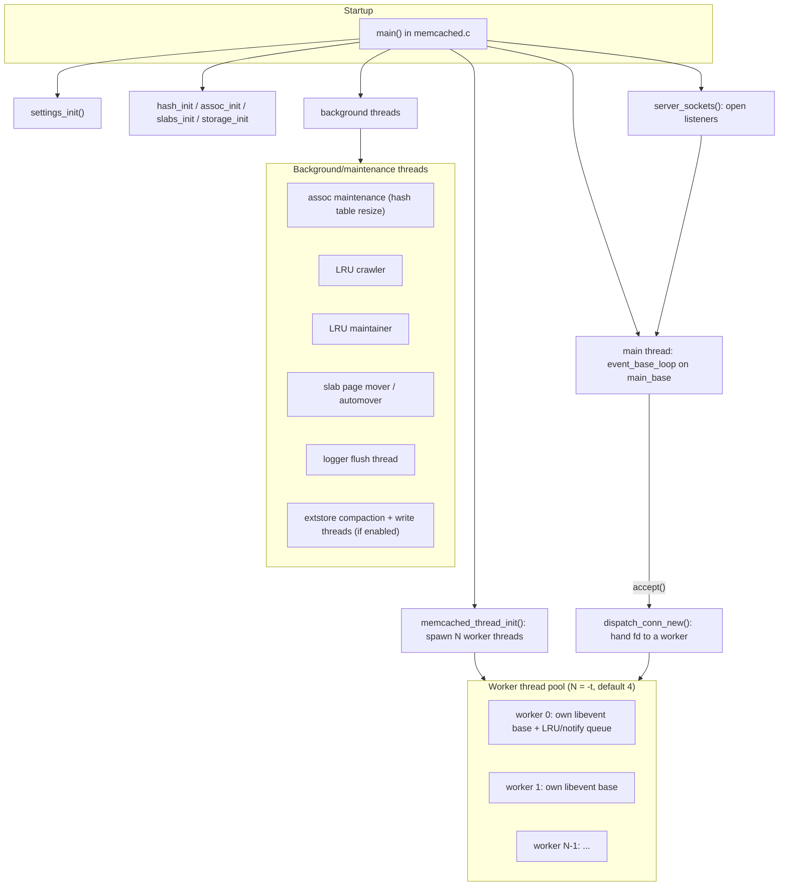
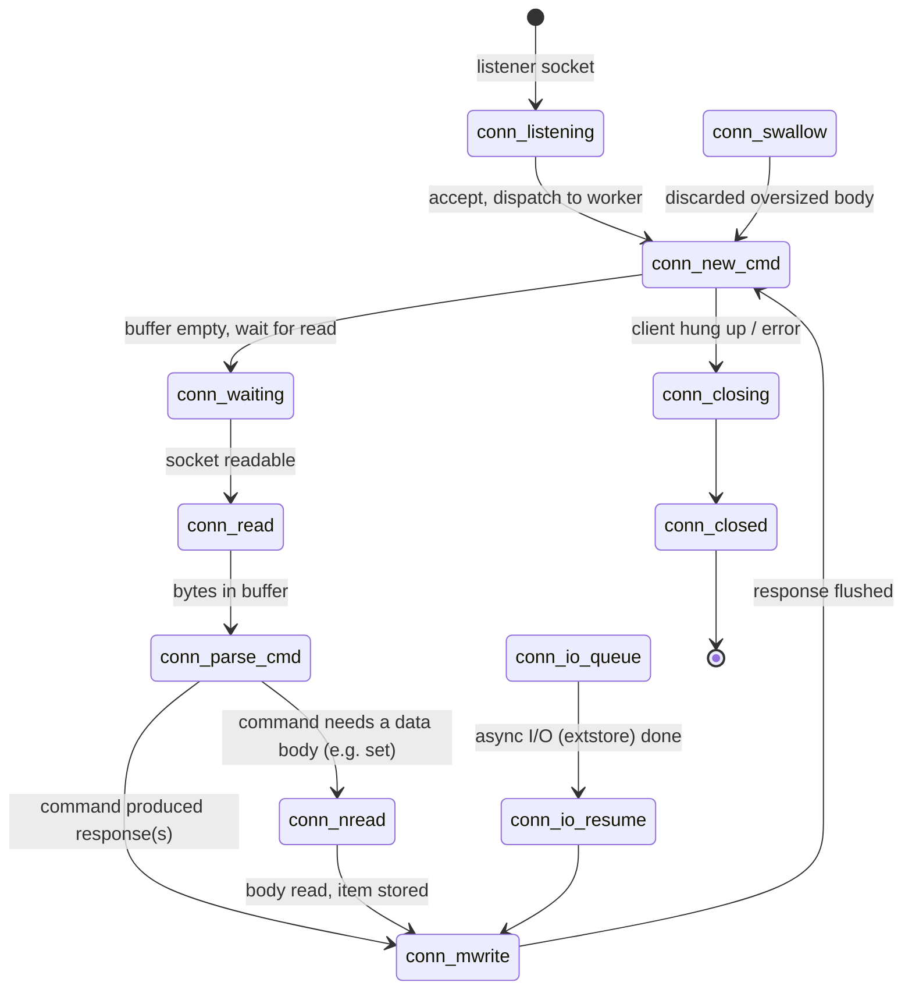
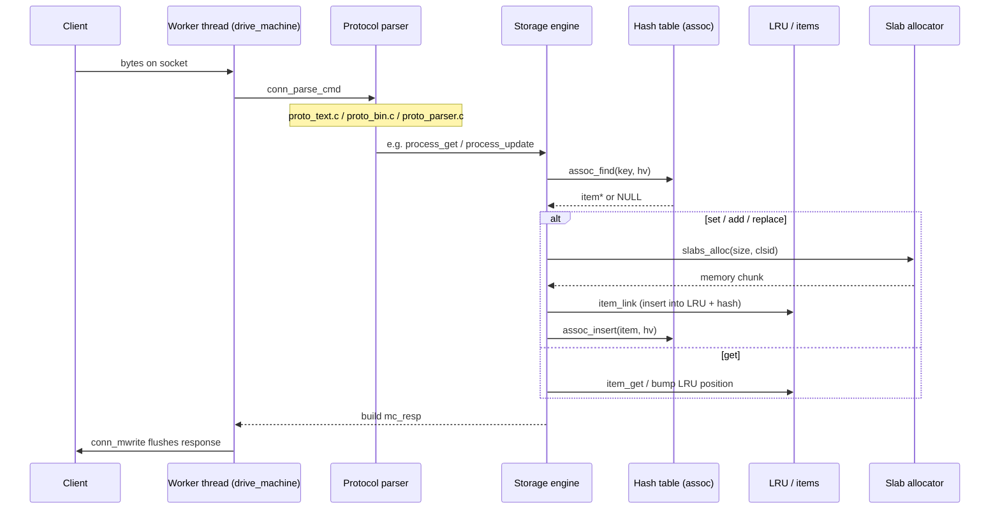
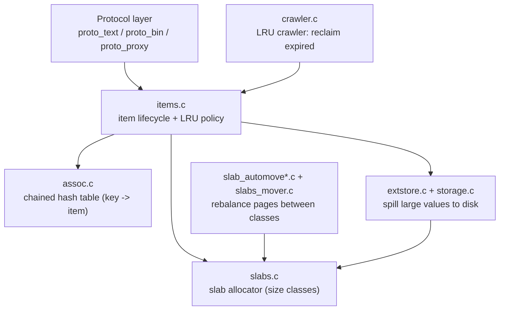

# Memcached Technical Architecture

This document explains how memcached 1.6.45 is put together: the process and
thread model, how a connection moves through the server, how a request becomes a
storage operation, and how the background machinery keeps memory bounded. It is
written for a new graduate joining as a core contributor. Read
`submodules-overview.md` alongside it for the file-by-file breakdown, and
`dependency-graph.md` for the include structure.

## 1. What memcached is

Memcached is an in-memory key/value cache. Clients connect over TCP, UDP, or a
Unix socket and issue simple commands (`get`, `set`, `delete`, the `meta`
commands, and so on) in either a text protocol or a binary protocol. Values live
entirely in RAM (optionally spilling large values to disk via extstore), and when
memory fills up the least recently used items are evicted. There is no durability
guarantee: memcached is a cache, not a database.

The whole server is a single process built around an event loop per worker
thread. It does not fork per connection and it does not use a thread per
connection. Instead a small fixed pool of worker threads each run a libevent loop
and multiplex many connections.

## 2. Process and thread model

Key roles:

- **Main thread.** Parses command line options (`main()` in `memcached.c`),
  initializes every subsystem in a fixed order, opens the listening sockets, and
  then runs its own libevent loop whose main job is to `accept()` new connections
  and hand each accepted file descriptor to a worker via `dispatch_conn_new()`.
- **Worker threads.** Created by `memcached_thread_init()` in `thread.c`. There are
  `settings.num_threads` of them (the `-t` option, default 4, capped around 64).
  Each worker owns its own libevent `event_base` and a notification pipe/eventfd.
  When the main thread dispatches a new connection to a worker, it queues a
  `CQ_ITEM` and pokes the worker's notify pipe; the worker then owns that
  connection for its lifetime.
- **Background threads.** Long-running maintenance loops: hash table resizing
  (assoc maintenance), the LRU crawler (reclaiming expired items), the LRU
  maintainer (rebalancing hot/warm/cold queues), the slab page mover, the logger
  flush thread, and, when extstore is enabled, the disk write and compaction
  threads.

### Locking model, briefly

Memcached favors many fine-grained locks over one big lock so that N workers can
operate in parallel:

- **Item locks:** a bucketed array of mutexes (`item_locks`), selected by hashing
  the key. Protects an item's hash chain pointer and refcount.
- **LRU locks:** one lock per slab class LRU (`lru_locks`), protecting the
  `next/prev` LRU chain pointers inside items.
- **Slabs lock:** protects the slab allocator's free lists and class metadata.
- **Cache/stats locks:** protect global counters and the per-thread stats
  rollups.

The item struct comment (`memcached.h`) spells out which fields are under which
lock. A recurring rule: the LRU pointers (`next/prev`) are under the LRU lock, and
the hash chain pointer (`h_next`), refcount, and flags are under the item lock.

## 3. The connection object and its state machine

Every connection is a `struct conn` (defined in `memcached.h`). It holds the file
descriptor, the libevent event, the protocol in use, read and write buffers, the
current command being assembled, and a pointer back to the owning worker thread.

Connections are driven by an explicit state machine, `enum conn_states`, run by
`drive_machine()` in `memcached.c`. libevent calls `event_handler()` when the
socket is readable or writable; that calls `drive_machine()`, which loops over
states until the connection would block.

What the important states mean (from the enum in `memcached.h`):

- `conn_listening` - the special listener connection; its job is to `accept()`.
- `conn_new_cmd` - reset per-command state and get ready for the next command.
- `conn_waiting` / `conn_read` - wait for and read bytes into the read buffer.
- `conn_parse_cmd` - try to parse a complete command out of the buffered bytes.
- `conn_nread` - read a fixed number of body bytes (the value for a `set`).
- `conn_swallow` - read and throw away a body that was too large to store.
- `conn_mwrite` - write out one or many queued responses (the `mc_resp` chain).
- `conn_io_queue` / `conn_io_resume` / `conn_io_pending` - park the connection
  while an asynchronous operation (an extstore disk read) completes on another
  thread, then resume writing.
- `conn_closing` / `conn_closed` - tear down.

Responses are built as `mc_resp` objects (allocated from per-thread bundles) and
chained so that a multi-key `get` can stream many values in one `conn_mwrite`
pass.

## 4. Request lifecycle: from bytes to a storage operation

The three protocol front ends share the same storage back end:

- **Text protocol** (`proto_text.c`) parses classic ASCII commands and the newer
  `meta` commands. It leans on `proto_parser.c` for tokenizing.
- **Binary protocol** (`proto_bin.c`) parses the length-prefixed binary protocol.
- **Proxy protocol** (`proto_proxy.c` and the `proxy_*.c` files) is a different
  mode: instead of storing locally, memcached acts as a routing proxy to other
  memcached servers, with routing logic scriptable in Lua.

All of them ultimately call into the storage engine: `items.c` for item lifecycle
(`item_alloc`, `item_link`, `item_get`, `item_unlink`), `assoc.c` for the hash
table, and `slabs.c` for memory.

## 5. The storage stack

- **Slab allocator (`slabs.c`).** Memory is carved into 1 MB pages, each page cut
  into fixed-size chunks belonging to a *slab class*. Class sizes grow by a factor
  (default 1.25). Allocating an item picks the smallest class that fits, which
  bounds fragmentation at the cost of some slack per item. Free chunks are kept on
  per-class free lists.
- **Hash table (`assoc.c`).** A power-of-two bucket array of singly linked chains
  (`h_next`). `assoc_find` walks a chain comparing key length then bytes. When the
  table gets too full it is resized by the assoc maintenance thread, which
  migrates buckets incrementally so the server keeps serving during a resize.
- **Items and LRU (`items.c`).** An item is a header (`struct _stritem`) followed
  inline by the CAS value, the key, the flags/length ASCII prefix, and the data.
  Items live in segmented LRUs (HOT, WARM, COLD, plus a TEMP queue) per slab
  class. Access bumps an item toward the hot end; the LRU maintainer and crawler
  move and reclaim items to keep memory available.
- **External storage (`extstore.c` + `storage.c`).** Optional. Large values can be
  written to disk pages while a small pointer stays in RAM, letting a server cache
  far more data than fits in memory. Reads of spilled values are asynchronous:
  the connection parks in `conn_io_queue` until the disk read completes.

## 6. Background maintenance

These threads run for the life of the process and keep the cache healthy:

| Thread | File | Job |
|---|---|---|
| Assoc maintenance | `assoc.c` | Grow the hash table and migrate buckets incrementally. |
| LRU crawler | `crawler.c` | Walk LRUs reclaiming expired/dead items; also powers metadata dumps. |
| LRU maintainer | `items.c` | Rebalance HOT/WARM/COLD queues, drive evictions. |
| Slab page mover | `slabs_mover.c`, `slab_automove*.c` | Move whole pages between slab classes when demand shifts. |
| Logger | `logger.c` | Per-worker ring buffers flushed by a dedicated thread for `watch`/log streams. |
| Extstore write/compact | `storage.c`, `extstore.c` | Flush values to disk and compact disk pages. |

## 7. Startup order (why it matters)

`main()` initializes subsystems in a dependency-respecting order. A simplified
sequence:

1. `settings_init()` - fill the global `settings` with defaults.
2. Parse command line options (may override settings), `storage_init_config()`.
3. Create `main_base` (libevent), `stats_init()`, `logger_init()` + `logger_create()`.
4. `conn_init()`, `hash_init()`, `assoc_init()`, `slabs_init()`.
5. `storage_init()` if extstore is enabled.
6. `memcached_thread_init()` - spawn workers (must exist before we accept).
7. Start background threads: assoc maintenance, LRU crawler, LRU maintainer, slab
   mover, extstore write/compact.
8. Open listeners: `server_socket_unix()`, `server_sockets()` for TCP/UDP.
9. Optionally `drop_privileges()`.
10. Enter `event_base_loop(main_base, ...)` and serve until shutdown.

The ordering guarantees that by the time a socket can accept a connection, the
hash table, allocator, worker threads, and (if configured) disk storage are all
live.

## 8. Where to go next

- File-by-file responsibilities and per-subsystem diagrams: `submodules-overview.md`.
- Include/dependency structure and the header spine: `dependency-graph.md`.
- Per-file deep dives (L1-L4): `docs/files/<name>.md` (Goal 3).
- Performance/SIMD notes: `optimization-opportunities.md`.
