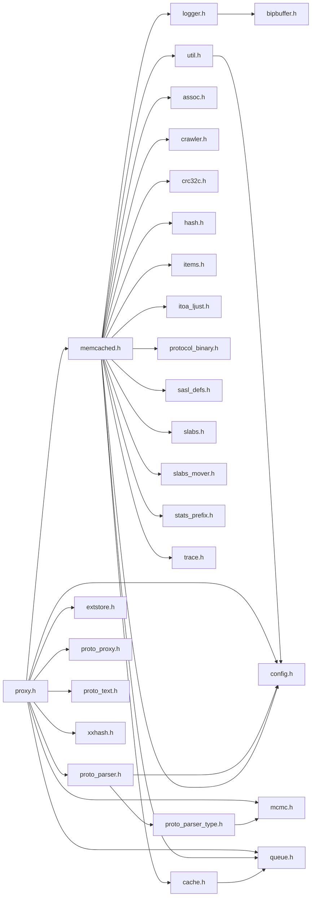

# Memcached File-to-File Dependency Graph

This document maps the `#include` dependencies between the C source files and
headers of memcached 1.6.45. It is generated from the source by
`scripts/analyze_includes.py` and `scripts/gen_dependency_doc.py`, and it is the
reference that drives the per-file documentation work (Goal 3).

## How this was produced

- The full source was configured and compiled with `bear` to capture a
  compilation database (`memcached/compile_commands.json`, 137 entries covering
  both the release and debug builds plus the vendored Lua interpreter).
- Every project translation unit was preprocessed with `gcc -E` into fully
  macro-expanded `.i` files under `docs/analysis/expanded/` so that later
  analysis can reason about post-macro code.
- A CodeQL C/C++ database was built over the same compilation
  (`.codeql/memcached-codeql-db`, ~38k lines of code).
- Every `#include` directive in the project's own `.c`/`.h` files was parsed.
  Includes that resolve to another project file become internal edges; the rest
  are recorded as external/system dependencies. Vendored Lua and liburing are
  excluded as nodes (they are third-party trees), but the vendored `mcmc`
  client is included because it is part of `memcached_SOURCES`.

The model has **97 nodes** 
(58 C files, 39 headers) and 
**151 internal include edges**.

## The header spine (who everything depends on)

A handful of headers act as hubs. `memcached.h` is the central contract: it
declares the connection object, settings, item structures, and the bulk of the
server API, so almost every `.c` file includes it. `proxy.h` plays the same role
for the proxy subsystem, and `storage.h` for the extstore path.

| Header | Included by (fan-in) |
|---|---|
| `memcached.h` | 29 |
| `proxy.h` | 16 |
| `storage.h` | 11 |
| `config.h` | 7 |
| `tls.h` | 5 |
| `util.h` | 4 |
| `base64.h` | 4 |
| `bipbuffer.h` | 4 |
| `queue.h` | 4 |
| `mcmc.h` | 4 |
| `slabs_mover.h` | 4 |
| `proto_proxy.h` | 4 |
| `proto_parser.h` | 4 |
| `authfile.h` | 3 |
| `cache.h` | 3 |

Dependents of the top hub headers:

```mermaid
graph LR
  memcached_h([memcached.h])
  proxy_h([proxy.h])
  storage_h([storage.h])
  config_h([config.h])
  assoc_c[assoc.c] --> memcached_h
  crawler_c[crawler.c] --> memcached_h
  crawler_c[crawler.c] --> storage_h
  daemon_c[daemon.c] --> memcached_h
  darwin_priv_c[darwin_priv.c] --> memcached_h
  extstore_c[extstore.c] --> config_h
  freebsd_priv_c[freebsd_priv.c] --> memcached_h
  globals_c[globals.c] --> memcached_h
  hash_c[hash.c] --> memcached_h
  items_c[items.c] --> memcached_h
  items_c[items.c] --> storage_h
  jenkins_hash_c[jenkins_hash.c] --> memcached_h
  linux_priv_c[linux_priv.c] --> config_h
  linux_priv_c[linux_priv.c] --> memcached_h
  logger_c[logger.c] --> memcached_h
  memcached_c[memcached.c] --> memcached_h
  memcached_c[memcached.c] --> storage_h
  openbsd_priv_c[openbsd_priv.c] --> memcached_h
  proto_bin_c[proto_bin.c] --> memcached_h
  proto_bin_c[proto_bin.c] --> storage_h
  proto_parser_c[proto_parser.c] --> memcached_h
  proto_parser_c[proto_parser.c] --> storage_h
  proto_proxy_c[proto_proxy.c] --> proxy_h
  proto_text_c[proto_text.c] --> memcached_h
  proto_text_c[proto_text.c] --> storage_h
  proxy_config_c[proxy_config.c] --> proxy_h
  proxy_inspector_c[proxy_inspector.c] --> proxy_h
  proxy_internal_c[proxy_internal.c] --> proxy_h
  proxy_internal_c[proxy_internal.c] --> storage_h
  proxy_jump_hash_c[proxy_jump_hash.c] --> proxy_h
  proxy_lua_c[proxy_lua.c] --> proxy_h
  proxy_lua_c[proxy_lua.c] --> storage_h
  proxy_luafgen_c[proxy_luafgen.c] --> proxy_h
  proxy_mutator_c[proxy_mutator.c] --> proxy_h
  proxy_network_c[proxy_network.c] --> proxy_h
  proxy_ratelim_c[proxy_ratelim.c] --> proxy_h
  proxy_request_c[proxy_request.c] --> proxy_h
  proxy_result_c[proxy_result.c] --> proxy_h
  proxy_ring_hash_c[proxy_ring_hash.c] --> proxy_h
  proxy_tls_c[proxy_tls.c] --> proxy_h
  proxy_ustats_c[proxy_ustats.c] --> proxy_h
  proxy_xxhash_c[proxy_xxhash.c] --> proxy_h
  restart_c[restart.c] --> memcached_h
  sasl_defs_c[sasl_defs.c] --> memcached_h
  sizes_c[sizes.c] --> memcached_h
  slab_automove_c[slab_automove.c] --> memcached_h
  slab_automove_extstore_c[slab_automove_extstore.c] --> memcached_h
  slabs_c[slabs.c] --> memcached_h
  slabs_mover_c[slabs_mover.c] --> memcached_h
  slabs_mover_c[slabs_mover.c] --> storage_h
  solaris_priv_c[solaris_priv.c] --> memcached_h
  stats_prefix_c[stats_prefix.c] --> memcached_h
  storage_c[storage.c] --> memcached_h
  storage_c[storage.c] --> storage_h
  testapp_c[testapp.c] --> config_h
  thread_c[thread.c] --> memcached_h
  thread_c[thread.c] --> storage_h
  tls_c[tls.c] --> memcached_h
```

## Header-to-header include graph

Restricting the graph to headers reveals the architectural skeleton without the
noise of every `.c` file. An edge `A --> B` means header A includes header B.

## Subsystems and their files

Files grouped by subsystem. Edges between subgraphs are aggregated
cross-subsystem `#include` relationships (deduplicated).

```mermaid
graph TB
  subgraph S0["Core server / event loop"]
    config_h[config.h]
    daemon_c[daemon.c]
    globals_c[globals.c]
    memcached_c[memcached.c]
    memcached_h[memcached.h]
    queue_h[queue.h]
    sizes_c[sizes.c]
    thread_c[thread.c]
    timedrun_c[timedrun.c]
    trace_h[trace.h]
  end
  subgraph S1["Protocol handling"]
    proto_bin_c[proto_bin.c]
    proto_bin_h[proto_bin.h]
    proto_parser_c[proto_parser.c]
    proto_parser_h[proto_parser.h]
    proto_parser_type_h[proto_parser_type.h]
    proto_text_c[proto_text.c]
    proto_text_h[proto_text.h]
    protocol_binary_h[protocol_binary.h]
  end
  subgraph S2["Storage engine (items/slabs/LRU)"]
    assoc_c[assoc.c]
    assoc_h[assoc.h]
    crawler_c[crawler.c]
    crawler_h[crawler.h]
    items_c[items.c]
    items_h[items.h]
    slab_automove_c[slab_automove.c]
    slab_automove_h[slab_automove.h]
    slab_automove_extstore_c[slab_automove_extstore.c]
    slab_automove_extstore_h[slab_automove_extstore.h]
    slabs_c[slabs.c]
    slabs_h[slabs.h]
    slabs_mover_c[slabs_mover.c]
    slabs_mover_h[slabs_mover.h]
  end
  subgraph S3["External storage (extstore)"]
    bipbuffer_c[bipbuffer.c]
    bipbuffer_h[bipbuffer.h]
    extstore_c[extstore.c]
    extstore_h[extstore.h]
    restart_c[restart.c]
    restart_h[restart.h]
    storage_c[storage.c]
    storage_h[storage.h]
  end
  subgraph S4["Hashing / checksums"]
    crc32c_c[crc32c.c]
    crc32c_h[crc32c.h]
    hash_c[hash.c]
    hash_h[hash.h]
    jenkins_hash_c[jenkins_hash.c]
    jenkins_hash_h[jenkins_hash.h]
    murmur3_hash_c[murmur3_hash.c]
    murmur3_hash_h[murmur3_hash.h]
    xxhash_h[xxhash.h]
  end
  subgraph S5["Proxy"]
    proto_proxy_c[proto_proxy.c]
    proto_proxy_h[proto_proxy.h]
    proxy_h[proxy.h]
    proxy_config_c[proxy_config.c]
    proxy_inspector_c[proxy_inspector.c]
    proxy_internal_c[proxy_internal.c]
    proxy_jump_hash_c[proxy_jump_hash.c]
    proxy_lua_c[proxy_lua.c]
    proxy_luafgen_c[proxy_luafgen.c]
    proxy_mutator_c[proxy_mutator.c]
    proxy_network_c[proxy_network.c]
    proxy_ratelim_c[proxy_ratelim.c]
    proxy_request_c[proxy_request.c]
    proxy_result_c[proxy_result.c]
    proxy_ring_hash_c[proxy_ring_hash.c]
    proxy_tls_c[proxy_tls.c]
    proxy_tls_h[proxy_tls.h]
    proxy_ustats_c[proxy_ustats.c]
    proxy_xxhash_c[proxy_xxhash.c]
  end
  subgraph S6["Crypto / auth / TLS"]
    authfile_c[authfile.c]
    authfile_h[authfile.h]
    base64_c[base64.c]
    base64_h[base64.h]
    md5_c[md5.c]
    md5_h[md5.h]
    sasl_defs_c[sasl_defs.c]
    sasl_defs_h[sasl_defs.h]
    tls_c[tls.c]
    tls_h[tls.h]
  end
  subgraph S7["Logging / stats"]
    logger_c[logger.c]
    logger_h[logger.h]
    stats_prefix_c[stats_prefix.c]
    stats_prefix_h[stats_prefix.h]
  end
  subgraph S8["Utilities"]
    cache_c[cache.c]
    cache_h[cache.h]
    itoa_ljust_c[itoa_ljust.c]
    itoa_ljust_h[itoa_ljust.h]
    util_c[util.c]
    util_h[util.h]
  end
  subgraph S9["Platform privilege drop"]
    darwin_priv_c[darwin_priv.c]
    freebsd_priv_c[freebsd_priv.c]
    linux_priv_c[linux_priv.c]
    openbsd_priv_c[openbsd_priv.c]
    solaris_priv_c[solaris_priv.c]
  end
  subgraph S10["Vendored client (mcmc)"]
    mcmc_c[mcmc.c]
    mcmc_h[mcmc.h]
  end
  subgraph S11["Test harness"]
    testapp_c[testapp.c]
  end
  S2 ==>|7| S0
  S6 ==>|1| S8
  S8 ==>|2| S0
  S2 ==>|1| S6
  S2 ==>|4| S3
  S9 ==>|6| S0
  S3 ==>|3| S0
  S4 ==>|2| S0
  S7 ==>|2| S3
  S7 ==>|2| S0
  S0 ==>|4| S6
  S0 ==>|3| S1
  S0 ==>|2| S5
  S0 ==>|3| S3
  S0 ==>|6| S2
  S0 ==>|3| S8
  S0 ==>|2| S4
  S0 ==>|2| S7
  S1 ==>|4| S0
  S1 ==>|3| S3
  S1 ==>|4| S6
  S1 ==>|1| S10
  S1 ==>|1| S5
  S5 ==>|3| S0
  S5 ==>|3| S3
  S5 ==>|1| S10
  S5 ==>|3| S1
  S5 ==>|1| S4
  S5 ==>|2| S6
  S6 ==>|2| S0
  S11 ==>|2| S8
  S11 ==>|1| S0
  S11 ==>|3| S4
  S11 ==>|1| S1
  S11 ==>|1| S7
```

## Fan-out: project headers pulled in by each C file

| C file | # project headers | Headers |
|---|---|---|
| `assoc.c` | 1 | `memcached.h` |
| `authfile.c` | 2 | `authfile.h`, `util.h` |
| `base64.c` | 1 | `base64.h` |
| `bipbuffer.c` | 1 | `bipbuffer.h` |
| `cache.c` | 1 | `cache.h` |
| `crawler.c` | 3 | `base64.h`, `memcached.h`, `storage.h` |
| `crc32c.c` | 1 | `crc32c.h` |
| `daemon.c` | 1 | `memcached.h` |
| `darwin_priv.c` | 1 | `memcached.h` |
| `example.c` | 1 | `mcmc.h` |
| `extstore.c` | 2 | `config.h`, `extstore.h` |
| `freebsd_priv.c` | 1 | `memcached.h` |
| `globals.c` | 1 | `memcached.h` |
| `hash.c` | 4 | `jenkins_hash.h`, `memcached.h`, `murmur3_hash.h`, `xxhash.h` |
| `items.c` | 4 | `bipbuffer.h`, `memcached.h`, `slabs_mover.h`, `storage.h` |
| `itoa_ljust.c` | 1 | `itoa_ljust.h` |
| `jenkins_hash.c` | 2 | `jenkins_hash.h`, `memcached.h` |
| `linux_priv.c` | 2 | `config.h`, `memcached.h` |
| `logger.c` | 2 | `bipbuffer.h`, `memcached.h` |
| `mcmc.c` | 1 | `mcmc.h` |
| `md5.c` | 1 | `md5.h` |
| `memcached.c` | 9 | `authfile.h`, `memcached.h`, `proto_bin.h`, `proto_proxy.h`, `proto_text.h`, `restart.h`, `slabs_mover.h`, `storage.h`, `tls.h` |
| `murmur3_hash.c` | 1 | `murmur3_hash.h` |
| `openbsd_priv.c` | 1 | `memcached.h` |
| `proto_bin.c` | 3 | `memcached.h`, `proto_bin.h`, `storage.h` |
| `proto_parser.c` | 4 | `base64.h`, `memcached.h`, `proto_parser.h`, `storage.h` |
| `proto_proxy.c` | 1 | `proxy.h` |
| `proto_text.c` | 8 | `authfile.h`, `base64.h`, `memcached.h`, `proto_parser.h`, `proto_proxy.h`, `proto_text.h`, `storage.h`, `tls.h` |
| `proxy_config.c` | 1 | `proxy.h` |
| `proxy_inspector.c` | 1 | `proxy.h` |
| `proxy_internal.c` | 2 | `proxy.h`, `storage.h` |
| `proxy_jump_hash.c` | 1 | `proxy.h` |
| `proxy_lua.c` | 3 | `proxy.h`, `proxy_tls.h`, `storage.h` |
| `proxy_luafgen.c` | 2 | `proxy.h`, `tls.h` |
| `proxy_mutator.c` | 1 | `proxy.h` |
| `proxy_network.c` | 2 | `proxy.h`, `proxy_tls.h` |
| `proxy_ratelim.c` | 1 | `proxy.h` |
| `proxy_request.c` | 2 | `proto_parser.h`, `proxy.h` |
| `proxy_result.c` | 1 | `proxy.h` |
| `proxy_ring_hash.c` | 2 | `md5.h`, `proxy.h` |
| `proxy_tls.c` | 2 | `proxy.h`, `proxy_tls.h` |
| `proxy_ustats.c` | 1 | `proxy.h` |
| `proxy_xxhash.c` | 1 | `proxy.h` |
| `restart.c` | 2 | `memcached.h`, `restart.h` |
| `sasl_defs.c` | 1 | `memcached.h` |
| `sizes.c` | 1 | `memcached.h` |
| `slab_automove.c` | 2 | `memcached.h`, `slab_automove.h` |
| `slab_automove_extstore.c` | 2 | `memcached.h`, `slab_automove_extstore.h` |
| `slabs.c` | 1 | `memcached.h` |
| `slabs_mover.c` | 5 | `memcached.h`, `slab_automove.h`, `slab_automove_extstore.h`, `slabs_mover.h`, `storage.h` |
| `solaris_priv.c` | 1 | `memcached.h` |
| `stats_prefix.c` | 1 | `memcached.h` |
| `storage.c` | 3 | `extstore.h`, `memcached.h`, `storage.h` |
| `testapp.c` | 8 | `cache.h`, `config.h`, `crc32c.h`, `hash.h`, `jenkins_hash.h`, `protocol_binary.h`, `stats_prefix.h`, `util.h` |
| `thread.c` | 5 | `memcached.h`, `proto_proxy.h`, `queue.h`, `storage.h`, `tls.h` |
| `timedrun.c` | 0 | (none) |
| `tls.c` | 2 | `memcached.h`, `tls.h` |
| `util.c` | 1 | `util.h` |

## Fan-in: who includes each header

| Header | # includers | Included by |
|---|---|---|
| `assoc.h` | 1 | `memcached.h` |
| `authfile.h` | 3 | `authfile.c`, `memcached.c`, `proto_text.c` |
| `base64.h` | 4 | `base64.c`, `crawler.c`, `proto_parser.c`, `proto_text.c` |
| `bipbuffer.h` | 4 | `bipbuffer.c`, `items.c`, `logger.c`, `logger.h` |
| `cache.h` | 3 | `cache.c`, `memcached.h`, `testapp.c` |
| `config.h` | 7 | `extstore.c`, `linux_priv.c`, `memcached.h`, `proto_parser.h`, `proxy.h`, `testapp.c`, `util.h` |
| `crawler.h` | 1 | `memcached.h` |
| `crc32c.h` | 3 | `crc32c.c`, `memcached.h`, `testapp.c` |
| `extstore.h` | 3 | `extstore.c`, `proxy.h`, `storage.c` |
| `hash.h` | 2 | `memcached.h`, `testapp.c` |
| `items.h` | 1 | `memcached.h` |
| `itoa_ljust.h` | 2 | `itoa_ljust.c`, `memcached.h` |
| `jenkins_hash.h` | 3 | `hash.c`, `jenkins_hash.c`, `testapp.c` |
| `logger.h` | 1 | `memcached.h` |
| `mcmc.h` | 4 | `example.c`, `mcmc.c`, `proto_parser_type.h`, `proxy.h` |
| `md5.h` | 2 | `md5.c`, `proxy_ring_hash.c` |
| `memcached.h` | 29 | `assoc.c`, `crawler.c`, `daemon.c`, `darwin_priv.c`, `freebsd_priv.c`, `globals.c`, `hash.c`, `items.c`, `jenkins_hash.c`, `linux_priv.c`, `logger.c`, `memcached.c`, `openbsd_priv.c`, `proto_bin.c`, `proto_parser.c`, `proto_text.c`, `proxy.h`, `restart.c`, `sasl_defs.c`, `sizes.c`, `slab_automove.c`, `slab_automove_extstore.c`, `slabs.c`, `slabs_mover.c`, `solaris_priv.c`, `stats_prefix.c`, `storage.c`, `thread.c`, `tls.c` |
| `murmur3_hash.h` | 2 | `hash.c`, `murmur3_hash.c` |
| `proto_bin.h` | 2 | `memcached.c`, `proto_bin.c` |
| `proto_parser.h` | 4 | `proto_parser.c`, `proto_text.c`, `proxy.h`, `proxy_request.c` |
| `proto_parser_type.h` | 1 | `proto_parser.h` |
| `proto_proxy.h` | 4 | `memcached.c`, `proto_text.c`, `proxy.h`, `thread.c` |
| `proto_text.h` | 3 | `memcached.c`, `proto_text.c`, `proxy.h` |
| `protocol_binary.h` | 2 | `memcached.h`, `testapp.c` |
| `proxy.h` | 16 | `proto_proxy.c`, `proxy_config.c`, `proxy_inspector.c`, `proxy_internal.c`, `proxy_jump_hash.c`, `proxy_lua.c`, `proxy_luafgen.c`, `proxy_mutator.c`, `proxy_network.c`, `proxy_ratelim.c`, `proxy_request.c`, `proxy_result.c`, `proxy_ring_hash.c`, `proxy_tls.c`, `proxy_ustats.c`, `proxy_xxhash.c` |
| `proxy_tls.h` | 3 | `proxy_lua.c`, `proxy_network.c`, `proxy_tls.c` |
| `queue.h` | 4 | `cache.h`, `memcached.h`, `proxy.h`, `thread.c` |
| `restart.h` | 2 | `memcached.c`, `restart.c` |
| `sasl_defs.h` | 1 | `memcached.h` |
| `slab_automove.h` | 2 | `slab_automove.c`, `slabs_mover.c` |
| `slab_automove_extstore.h` | 2 | `slab_automove_extstore.c`, `slabs_mover.c` |
| `slabs.h` | 1 | `memcached.h` |
| `slabs_mover.h` | 4 | `items.c`, `memcached.c`, `memcached.h`, `slabs_mover.c` |
| `stats_prefix.h` | 2 | `memcached.h`, `testapp.c` |
| `storage.h` | 11 | `crawler.c`, `items.c`, `memcached.c`, `proto_bin.c`, `proto_parser.c`, `proto_text.c`, `proxy_internal.c`, `proxy_lua.c`, `slabs_mover.c`, `storage.c`, `thread.c` |
| `tls.h` | 5 | `memcached.c`, `proto_text.c`, `proxy_luafgen.c`, `thread.c`, `tls.c` |
| `trace.h` | 1 | `memcached.h` |
| `util.h` | 4 | `authfile.c`, `memcached.h`, `testapp.c`, `util.c` |
| `xxhash.h` | 2 | `hash.c`, `proxy.h` |

## External and system dependencies

The most widely used non-project headers, ranked by how many project files
include them. These indicate the platform and library surface memcached relies
on (POSIX threads, sockets, libevent, OpenSSL, Lua, etc.).

| External header | # project files including it |
|---|---|
| `string.h` | 36 |
| `stdlib.h` | 34 |
| `stdio.h` | 26 |
| `assert.h` | 16 |
| `fcntl.h` | 11 |
| `errno.h` | 11 |
| `unistd.h` | 11 |
| `pthread.h` | 10 |
| `sys/socket.h` | 10 |
| `sys/stat.h` | 9 |
| `signal.h` | 8 |
| `netinet/in.h` | 7 |
| `sys/types.h` | 7 |
| `stdint.h` | 7 |
| `sys/resource.h` | 6 |
| `limits.h` | 6 |
| `stdbool.h` | 5 |
| `stddef.h` | 5 |
| `poll.h` | 5 |
| `ctype.h` | 5 |
| `sys/uio.h` | 4 |
| `sys/mman.h` | 4 |
| `inttypes.h` | 3 |
| `time.h` | 3 |
| `arpa/inet.h` | 3 |
| `stdarg.h` | 3 |
| `netdb.h` | 3 |
| `sysexits.h` | 3 |
| `openssl/ssl.h` | 3 |
| `sys/sysctl.h` | 2 |
| `atomic.h` | 2 |
| `netinet/tcp.h` | 2 |
| `sys/param.h` | 2 |
| `sys/time.h` | 2 |
| `sys/eventfd.h` | 2 |
| `openssl/err.h` | 2 |
| `sys/wait.h` | 2 |

