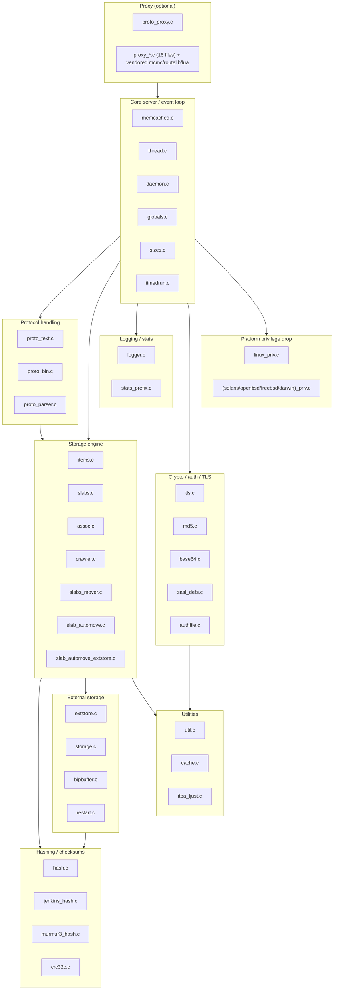
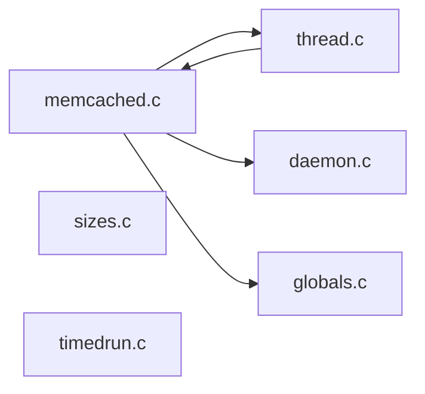
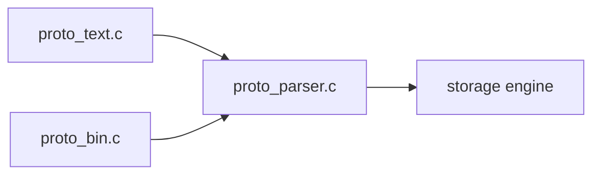
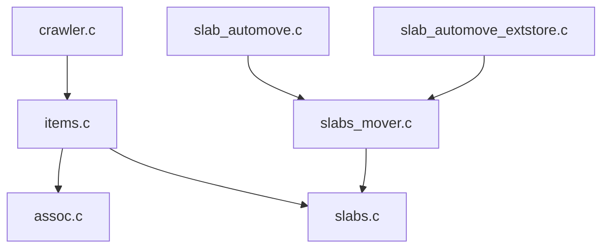
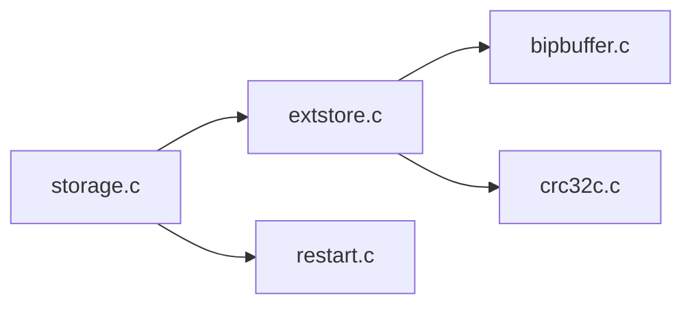
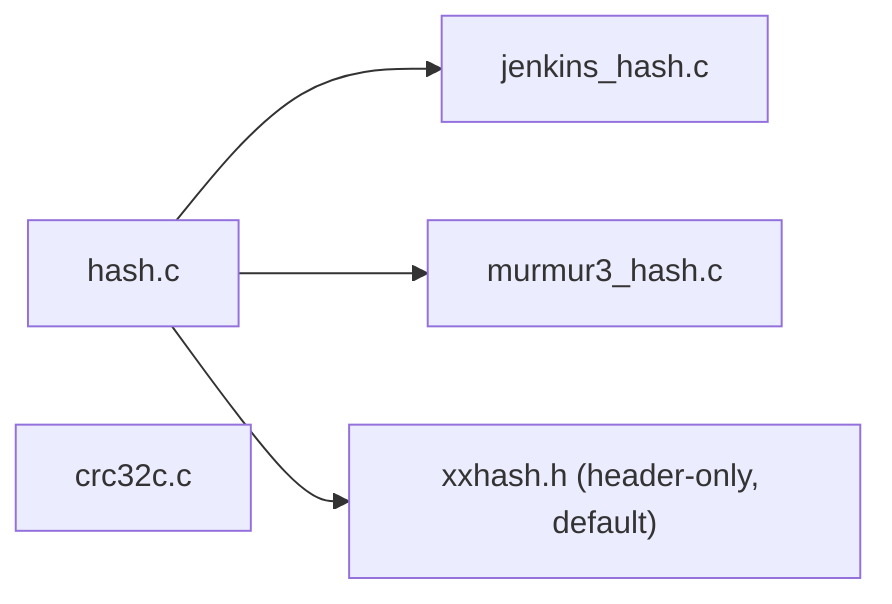
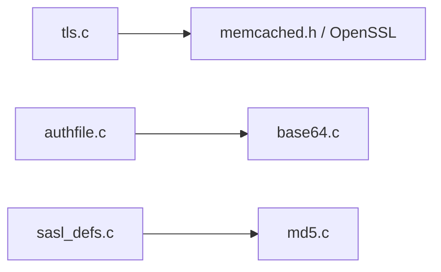
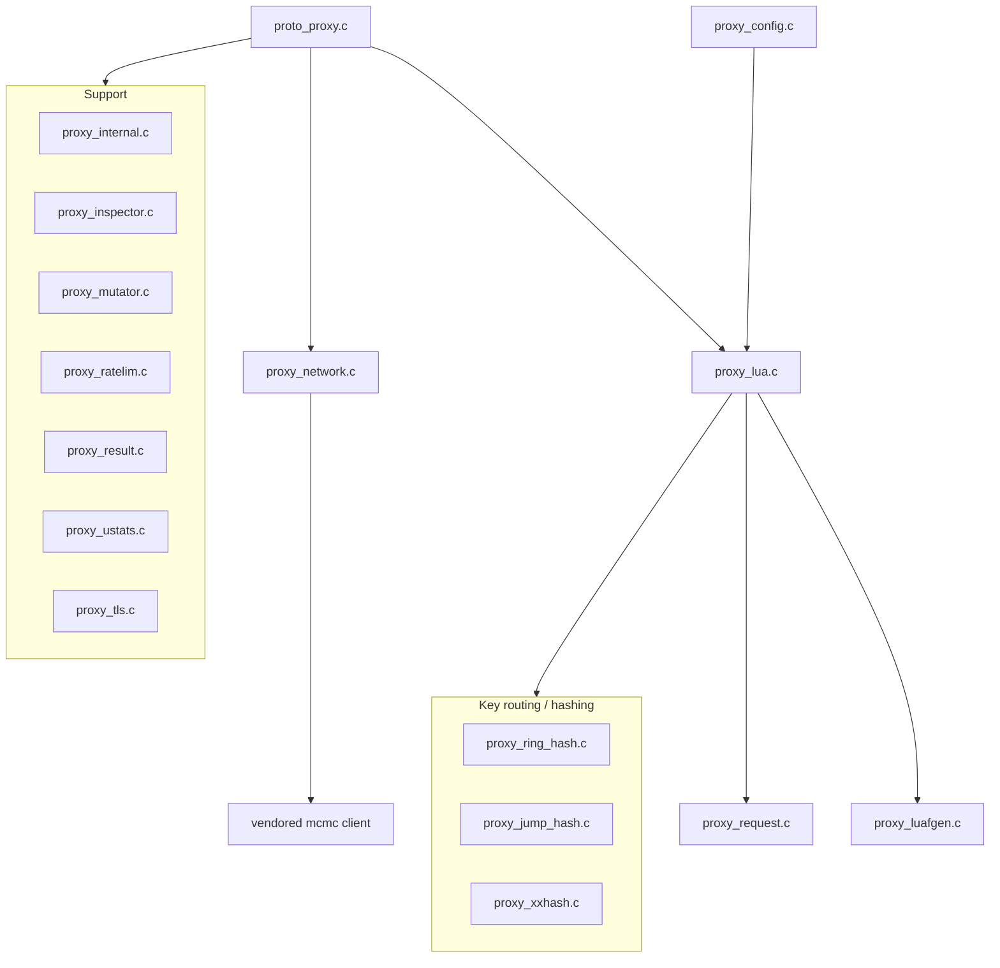

# Memcached Submodules Overview

This document groups memcached 1.6.45's C files into subsystems, says what each
file is responsible for, and shows a mermaid diagram per subsystem plus a
whole-program map. It complements `architecture.md` (how the pieces work
together) and `dependency-graph.md` (the raw include structure). The grouping is
derived from `analysis/include_graph.json`.

Every `.c` file that is part of the build is listed exactly once below. The
vendored Lua interpreter and liburing are third-party trees and are not itemized;
the vendored `mcmc` client and `routelib` are part of the proxy build and are
noted where relevant.

## Whole-program subsystem map

The arrows are aggregated "depends on" relationships (a subsystem includes
headers from another). Core sits on top of nearly everything; the storage engine
is the hub the protocol layer talks to; hashing and utilities are leaves.

---

## Core server / event loop

The main process, the worker-thread pool, daemonization, and small
build/introspection helpers.

| File | Responsibility |
|---|---|
| `memcached.c` | The heart of the server: `main()`, option parsing, subsystem init order, the connection object, the `drive_machine()` state machine, `conn_new`/`dispatch_conn_new`, listener setup, and stats. By far the largest file (~6.3k lines). |
| `thread.c` | The worker-thread pool: `memcached_thread_init()`, per-thread libevent bases, the connection queue between the main thread and workers, item-lock helpers, and cross-thread notification. |
| `daemon.c` | Detach from the controlling terminal (classic `fork`/`setsid` daemonize). |
| `globals.c` | Definitions of the global variables declared `extern` in `memcached.h` (the single `settings`, `stats`, etc.), kept in one TU to avoid duplicate-symbol issues. |
| `sizes.c` | A tiny diagnostic program that prints `sizeof` the core structures; a developer tool, not part of the server. |
| `timedrun.c` | A standalone helper used by the test suite to run a program with a timeout; not linked into the server. |

## Protocol handling

Parsing client commands and formatting responses. All three front ends feed the
same storage engine.

| File | Responsibility |
|---|---|
| `proto_text.c` | The classic ASCII protocol and the modern `meta` commands (`mg`, `ms`, `md`, ...). Parses a command line and dispatches to storage operations. |
| `proto_bin.c` | The length-prefixed binary protocol (headers defined in `protocol_binary.h`). |
| `proto_parser.c` | Shared tokenizer and request-building helpers used by the text/meta path, including response assembly with `itoa` and base64 for keys. |

## Storage engine (items, slabs, LRU)

The core of a cache: memory allocation, the key/value hash table, the item
lifecycle, and the machinery that keeps memory available.

| File | Responsibility |
|---|---|
| `items.c` | Item lifecycle and LRU policy: `item_alloc`, `item_link`/`item_unlink`, `item_get`, refcount management, the segmented HOT/WARM/COLD/TEMP LRUs, and the LRU maintainer thread. |
| `slabs.c` | The slab allocator: 1 MB pages cut into fixed-size chunks per size class, per-class free lists, `slabs_alloc`/`slabs_free`. |
| `assoc.c` | The chained hash table mapping keys to items, plus the incremental hash-table-resize maintenance thread. |
| `crawler.c` | The LRU crawler: background reclamation of expired items and the engine behind `lru_crawler metadump`/`mgdump`. |
| `slabs_mover.c` | The mechanism that relocates a whole slab page from one class to another (page moving), used when demand shifts between item sizes. |
| `slab_automove.c` | The default policy that decides *when* to move a page between classes based on eviction pressure. |
| `slab_automove_extstore.c` | The extstore-aware variant of that policy, factoring in disk spill. |

## External storage (extstore)

Optional. Lets a server hold far more data than fits in RAM by spilling large
values to disk while keeping a small pointer in memory.

| File | Responsibility |
|---|---|
| `extstore.c` | The disk storage engine: disk pages, per-page write buffers, the async read/write path, and the compaction thread. |
| `storage.c` | The bridge between the item layer and extstore: deciding what to spill, writing values out, reading them back on demand, and the write/compact driver threads. |
| `bipbuffer.c` | A bipartite (double-mapped) ring buffer used as extstore's write buffer for contiguous batched writes. |
| `restart.c` | Warm restart support: persist enough metadata (via a mmapped region) that a restarted process can reattach to the existing memory/disk state. |

## Hashing / checksums

Fast key hashing for the hash table and CRC for data integrity.

| File | Responsibility |
|---|---|
| `hash.c` | Selects the active key-hash function via a single function pointer (`hash`). Default is XXH3; alternatives are Jenkins and Murmur3. |
| `jenkins_hash.c` | Bob Jenkins' `hashlittle`, the historical default. |
| `murmur3_hash.c` | MurmurHash3 (x86 32-bit variant). |
| `crc32c.c` | CRC-32C with a runtime-dispatched hardware path (`crc32q` on x86, ARMv8 CRC on aarch64) and a software fallback. Used by extstore and restart for integrity. |

Note: xxHash lives entirely in the header `xxhash.h` (included with
`XXH_INLINE_ALL`), so there is no `xxhash.c`.

## Crypto / auth / TLS

Transport security and client authentication.

| File | Responsibility |
|---|---|
| `tls.c` | Optional TLS support over OpenSSL: per-connection SSL objects and read/write shims. |
| `md5.c` | MD5, used by SASL CRAM-MD5 authentication (and by the proxy). |
| `base64.c` | Base64 encode/decode, used for binary-safe keys in the meta protocol and by the auth file. |
| `sasl_defs.c` | SASL glue: either wraps libsasl or provides a minimal built-in mechanism. |
| `authfile.c` | Parses the simple `user:password` auth file used when SASL is configured against a flat file. |

## Logging / stats

Structured logging streams and per-prefix statistics.

| File | Responsibility |
|---|---|
| `logger.c` | The `watch`/log subsystem: per-worker lock-free ring buffers written by workers and drained by a dedicated logger thread, delivered to `watch` clients. |
| `stats_prefix.c` | Optional per-key-prefix statistics (counts of gets/sets/hits by a configured separator). |

## Utilities

Small, dependency-light helpers used across the codebase.

| File | Responsibility |
|---|---|
| `util.c` | Misc helpers: safe string/number parsing (`safe_strtoull` etc.), URL encoding, and small buffer utilities. |
| `cache.c` | A simple fixed-size free-list object cache/allocator used for recycling small structures. |
| `itoa_ljust.c` | Very fast integer-to-ASCII conversion (2 digits at a time from a lookup table), used heavily when formatting responses. |

## Platform privilege drop

Per-OS implementations of sandboxing / dropping privileges after startup. Exactly
one is compiled, chosen by `configure` for the target OS.

| File | Responsibility |
|---|---|
| `linux_priv.c` | Linux: seccomp/capability-based privilege reduction. |
| `solaris_priv.c` | Solaris privileges. |
| `openbsd_priv.c` | OpenBSD `pledge`. |
| `freebsd_priv.c` | FreeBSD Capsicum. |
| `darwin_priv.c` | macOS sandbox. |

## Proxy (optional)

A large optional subsystem that turns memcached into a scriptable routing proxy in
front of other memcached servers. Routing and request handling are programmable in
Lua. Built only with `--enable-proxy`.

| File | Responsibility |
|---|---|
| `proto_proxy.c` | Entry point for proxy mode: wires the proxy into the connection state machine and command dispatch. |
| `proxy_lua.c` | The Lua VM integration: exposes the proxy API to Lua scripts and runs the user's routing code. |
| `proxy_luafgen.c` | The "function generator" Lua layer that builds per-request handler pipelines. |
| `proxy_config.c` | Loads and reloads the Lua configuration, managing config generations. |
| `proxy_request.c` | The proxy-side request object and its lifecycle. |
| `proxy_network.c` | Backend connections: talking to upstream memcached servers (using the vendored `mcmc` client), pooling, and I/O. |
| `proxy_internal.c` | Executes commands locally within the proxy when needed. |
| `proxy_inspector.c` | Lua-facing inspection/debugging helpers for requests and responses. |
| `proxy_mutator.c` | Request/response mutation primitives exposed to Lua. |
| `proxy_ratelim.c` | Rate limiting primitives. |
| `proxy_result.c` | The result object returned from backend calls. |
| `proxy_ring_hash.c` | Consistent hashing (ketama-style ring) for choosing a backend. |
| `proxy_jump_hash.c` | Jump consistent hashing, an alternative backend selector. |
| `proxy_xxhash.c` | xxHash exposure for the proxy's hashing needs. |
| `proxy_ustats.c` | User-defined statistics counters exposed to Lua. |
| `proxy_tls.c` | TLS for backend connections. |
| vendored `mcmc.c` | A minimal memcached client library used to talk to backends. |
| vendored `routelib` / `lua` | Default routing library and the Lua interpreter. |

## Coverage note

All 58 build-included C files are itemized above. The only `.c` under `vendor/`
not listed is `vendor/mcmc/example.c`, which is sample code and not compiled into
memcached. The five platform-priv files are mutually exclusive at build time
(only the target OS's file compiles), so on this Linux host only `linux_priv.c` is
in the compilation database.
